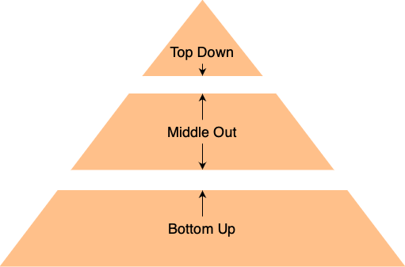
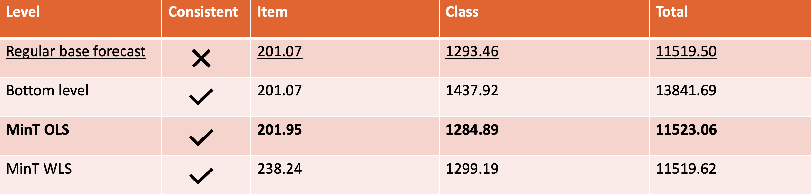

# forecast reconciliation

In many large enterprises, forecasts are made throughout the company on differing hierarchy levels for different goals. Perhaps one team creates forecasts for the expected sales of each individual product in the coming two weeks. Meanwhile, another team delivers forecasts for entire categories until the end of the year. A problem arises when multiple models are used throughout the
company and the results of each model don't add up. In order to utilize the best model for each 
application while still having a single source of truth, one can use reconciliation.

Forecast reconciliation is the process of transforming individual forecasts to be consistent according to a hierarchical
or grouped structure. 

### Simple reconciliation methods

The simplest method to achieve this consistency over levels is through the use of only one model to forecast a one level and aggregate to
different levels. Three ways to do so can be identified. Bottom up-, Top down- and Middle-out forecasting.

1. Bottom up forecasting entails creating forecasts for the lowest level in the hierarchy and summing up to other levels.


2. Top down forecasting does it the other way around by using top level forecasts and dividing down the hierarchy. Perhaps with some historical information as weighting.


3. The Middle-out methodology forecasts at the middle level and uses principles from bottom up and top down to aggregate to the other levels. Top down and middle-out strategies don't come without introducing bias.



In reality, these methods are hardly reconciliation at all. First, different aggregation levels usually need different models, accuracy and levels of explainability. Second, use cases on different aggegation levels need different features. In example, forecasting the total demand of a distribution center depends heavily on the local events and availability, whereas forecasting the nationwide demand for a single product might depend more on the national economy and popularity of the product.
These features may be completely hidden or not easily identifiable at other levels. 
Luckily, a more complex method allows for these flexibilities.

### The optimal reconciliation method

Hyndman¹ proposes an optimal reconciliation method notated as follows:

ỹ<sub>h</sub> = <b>SG</b>ŷ<sub>h</sub>

In this notation, we aim to find some matrix <b>G</b> which minimises the forecasting error variances of the set of coherent forecasts.
Simply said, matrix <b>G</b> takes all the forecasts of ŷ and combines them to give bottom level forecasts and then <b>S</b> adds them up.
Before finding this matrix, it is good practice to make sure the various ŷ forecasting levels produce unbiased forecasts.
This will make sure that the ỹ<sub>h</sub> will also be unbiased, provided that <b>SGS</b>' = <b>S</b>.

The variance of the reconciled forecasts <b>V</b><sub>h</sub> can be found by:

<b>V</b><sub>h</sub> = <b>SGW</b><sub>h</sub><b>G</b>'<b>S</b>' ~ Where( <b>W</b><sub>h</sub> = Var[(y<sub>T+h</sub> - ŷ<sub>h</sub>)] )

The optimal reconciliation method, also referred to as the Minimum Trace (MinT) estimator, minimizes the trace of V<sub>h</sub> when:

<b>G</b> = (<b>S</b>'<b>W</b><sup>-1</sup><sub>h</sub><b>S</b>)<sup>-1</sup><b>S</b>'<b>W</b><sup>-1</sup><sub>h</sub>

Therefor, the optimal reconciled forecasts are given by:

ỹ<sub>h</sub> = <b>S</b>(<b>S</b>'<b>W</b><sup>-1</sup><sub>h</sub><b>S</b>)<sup>-1</sup><b>S</b>'<b>W</b><sup>-1</sup><sub>h</sub> ŷ<sub>h</sub>

Retrieving <b>W</b><sub>h</sub> can be tedious when the amount of forecast series are large. If there are a million series, then
<b>W</b><sub>h</sub> becomes a matrix of one million by a million which might be hard to work with. Luckily, computational tricks can be used to make that easier.

Two will be discussed here:

OLS: If we ignore the <b>W</b><sub>h</sub> and set it to be the identity, then this becomes a bit less optimal, but a lot simpler.
This method solely uses the forecasts of all the levels and an identity matrix highlighting the hierarchical or grouped 
structure of the forecasts:

<b>G</b> = (<b>S</b>'<b>S</b>)<sup>-1</sup><b>S</b>'

WLS: Here the off-diagonals are ignored, so purely the diagonals are used:

<b>G</b> = (<b>S</b>'&Lambda;<sub>v</sub><b>S</b>)<sup>-1</sup><b>S</b>'&Lambda;<sub>v</sub> ~ Where ( &Lambda;<sub>v</sub> = diag(<b>W</b><sub>1</sub>)<sup>-1</sup> )

Next, these two methods together with the bottom-up non-reconciliation method are evaluated using a kaggle dataset about supermarket sales. 

### Use case: supermarket product sales

To showcase the usage of reconciliation we will look at supermarket sales from the cleaning supplies category. 
Within this category exist a collection of classes each with underlying products. 
These three levels (product, class, category) will make up the hierarchy for this use case.
One  model is trained on each of the three levels, creating a total of three models. For the purpose of simplicity all models use the same LightGBM architecture.

The data provides daily sales and a promotional indicator, alongside one macro-economic variable oil sales. 
Most feature engineering has to do with the usage of time features, lags, and transforming categorical features.
A train test split is made. The predictions of the testset are used to perform reconciliation on.

#### Reconciliation
 
In order to create a good comparison, the RMSE of the bottom up approach, OLS, and WLS are evaluated against each other. 
Given the literature, our expectation is that the bottom up approach will perform the worst, followed by OLS and WLS 
performing the best. For WLS we expect the RMSE to be the lowest for all levels, and thus only slightly worse than the 
RMSE of the original model forecasts.



The results show that compared to OLS and WLS, the bottom up approach performs significantly worse on RMSE. 
Second, without specifically training each model on each level with unique features to that level, OLS outperforms WLS. 
And unexpectedly, OLS outperforms the original class level model. With more tuning, it is expected that WLS should 
outperform OLS, but the quality of OLS with just the need of an identity matrix is better than expected.

### Summary and thoughts

Reconciliation can help create consistency in forecasts over different levels. Simply aggregating forecasts from one 
level to others does not make for good forecasts on all levels. Without much work, OLS and WLS reconciliation methods
can be used to create consistent forecasts without much loss in performance. With this, different models can be used for 
different purposes throughout the company whilst serving a single source of truth throughout the company.

Sources:
1. Publication on reconciliation: https://robjhyndman.com/publications/mint/
2. Textbook including notation and R implementation: https://otexts.com/fpp2/reconciliation.html

Git repo:
3. Python reconciliation repository: https://github.com/mpamey/forecast-reconciliation

Kaggle data:
4. https://www.kaggle.com/c/favorita-grocery-sales-forecasting

When replicating the results, please create the next folder structure with downloaded data files from kaggle in the root 
folder as the ETL looks for these.

```text
-data <- folder
--0_input <- folder
---holidays_events.csv
---items.csv
---oil.csv
---stores.csv
---train.csv
```